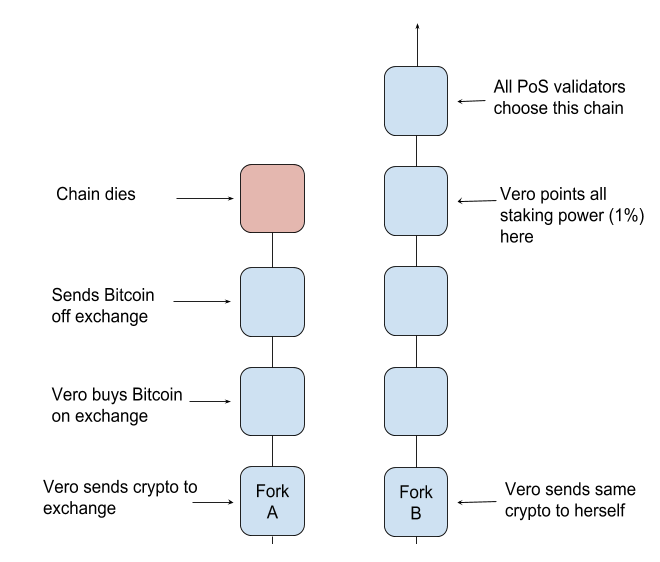

* Byzantine Fault Tolerance
    * Byzantine Fault - any fault (error) that presents different symptoms to different observers
    * Byzantine Failure - a loss of a system service due to a Byzantine Fault in systems that require consensus
    * Byzantine Fault Tolerance - means a system is able to operate normally and reach consensus, even when a system component fails with or without reason
        * A Byzantine Fault Tolerant System will be able to continue normal operation while lacking components that have failed, so as long as the number of working components exceeds the needed number to operate accurately
            * a BFT System will also be able to operate normally even if a system component hasn't completely failed, but instead, is just reporting inaccurate or false data
                * In this case, the other components in the system will be able to pick up on the fault component's inaccurate data, and will be ignored to achieve consensus
* Proof-of-Work
    * All nodes in a POW network compete to solve for a block hash below the target hash set by the network
        * These are used to generate a block hash:
            * previous block header
            * list of new transactions
            * a nonce (number used only once)
    * Mining in a POW system involves guessing a random nonce until the hash of the block to-be-mined is below the target hash set by the network 
* Proof-of-Stake
    * Actors in a POS system will receive a change to validate the next block based proportionally on the amount of stake they have in the network
        * Stake can be interpreted in multiple ways
            * 1. In early POS systems, stake referred to the amount of token one held for the network
            * 2. In later version of POS system, stake referrers to a security deposit one places in order to be eligible to be selected as the next block validator
    * Nothing at Stake Theory
        * This theory was presented with the idea of the earlier (2nd definition of stake) POS implementation
        * The theory represent a problem where every validator will build on every fork of the blockchain, because there is no disincentive to do so, as well as no hefty amount of computation needed like there is in a POW system
        * One attack that uses this theory would be a double spending attack:
        
* Leased Proof-of-Stake
    * Actors in a LPOS system lease their stake to staking nodes to increase the weight of stake for that node
        * In doing so, if a node that an actor leased to is selected to validate the next block, the actor that leased to that node gets a proportional share of the block reward via the network
* Delegate Proof-of-Stake
    * Actors in a DPOS system used their stake to vote elect a list of nodes that are made eligible to be randomly selected to validate the next block
    * There is no direct reward for the actors that delegate the block validator, like there is in LPOS
* Proof-of-Importance
    * Actions in a POI system are selected as the next block validators not only based on their stake in the network, but also based on their balance, reputation (determined by a separate system), and the number of transactions made to and from their address

ADDITIONAL RESOURCES
    * Byzantine Generals Problem - https://en.wikipedia.org/wiki/Byzantine_fault_tolerance#Byzantine_Generals'_Problem
    * Types of Consensus - https://mastanbtc.github.io/blockchainnotes/consensustypes/
    * Review of Blockchain Consensus Methods - https://blog.wavesplatform.com/review-of-blockchain-consensus-mechanisms-f575afae38f2
    * PODCAST: Overview and History of Consensus System Development - https://softwareengineeringdaily.com/2018/03/26/consensus-systems-with-ethan-buchman/