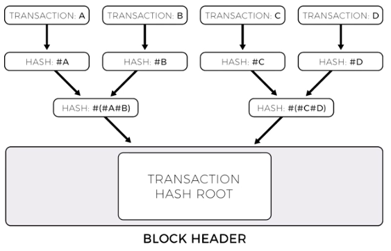
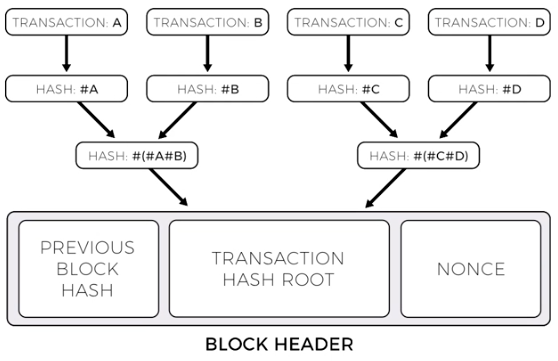
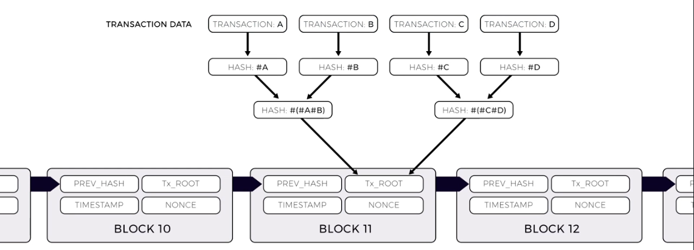

# Blockchain Structure

 The basic goal of a blockchain is to maintain a system state that everyone agrees on.

 Additional feature of a blockchain include:
 - Maintaining state in a peer-to-peer network
 - Manage state updates
    - All participants agree the updates are valid
        - This is done by utilizing a digital signature for the node which created the update
    - Blockchains facilitate consensus amongst the network peers
    - To many these updates, a collection of new updates are grouped together to form the body of a _block_
        - The contents of a _block_ are summarized using the _block's Merkle tree root_
        
        - Each _transaction_ included in the _body_ of the _block_ is hashed
        - Two _transaction hashes_ are then hashed together to form another hash
            - This process repeats until there are only two hashes left to hash together
        - After the last two hashes are combined and hashed, the _Merkle tree root hash_ is formed
            - This _Merkle tree root_ is what is included in the _block header_
        - Using the _Merkle tree root_ included in the _block header_, a network peer can validate that their copy of the _block's body of transactions_ hasn't been tampered with by computing the _Merkle tree root_ of the transactions, and comparing it's hash with the hash shared by other network peers.

## Basic Anatomy of a Block

A _block_ consists of:

- _Transaction Hash Root_
    - This is the _Merkle tree root_ of all the _transactions_ included in the body of the _block_
- _Previous Block Hash_
    - This is the hash of the last _block_ that was added to the blockchain
- _Nonce_
    - This is a random value that _miners_ are working to solve for

## Basic Anatomy of a Blockchain

A _blockchain_ consists of:

- Several _blocks_ that are linked together using the _previous block hash_

## Additional Resources
- [A visual demonstration of a blockchain data structure](https://anders.com/blockchain/)
- [Bitcoin Wiki - Blockchain](https://en.bitcoin.it/wiki/Block_chain)
- [Solidity Documentation Blockchain Basics](https://solidity.readthedocs.io/en/develop/introduction-to-smart-contracts.html#blockchain-basics)
