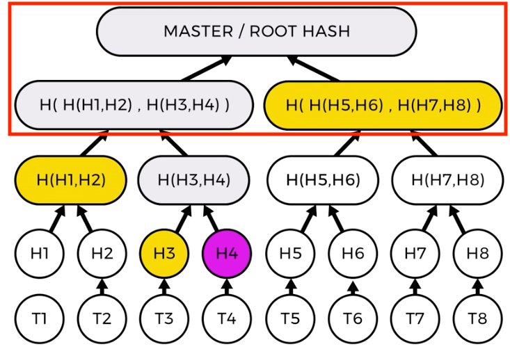

# Merkle Trees

- _Merkle Trees_ are data structures
    - Each _leaf_ in a _Merkle Tree_ are hashes of data
    - Each _node_ in a _Merkle Tree_ are hashes of it's children
    
    - In the above diagram, _T1-8_ are representing transactions containing data
    - _H1-8_ are representing cryptographic hashes of _T1-8_, respectively
    - _H(H1,H2)_ represents a hash of the combined hashes _H1_ and _H2_
        - The same applies to the following:
            - _H(H3,H4)_
            - _H(H5,H6)_
            - _H(H7,H8)_
    - _H( H(H1,H2), H(H3,H4) )_ represents a hash of the combined hashes _H(H1,H2)_ and _H(H3,H4)_
        - The same applies to the following:
            - _H( H(H5,H6), H(H7,H8) )_
    - At the very top, we have the _Master / Root Hash_
        - This represents a hash of the combined hashes _H( H(H1,H2), H(H3,H4) )_ and _H( H(H5,H6), H(H7,H8) )_
    - Because of the parent-children relationship of hashes, to cryptographically prove that transaction #4, _T4_, is apart of this _Merkle Tree_, all that is required is:
        - The hash of transaction #3, _H3_
        - The hash of the combined hashes of transaction #1 and #2, _H(H1, H2)_
        - The hash of the combined hashes of transactions #5-8, _H( H(H5,H6), H(H7,H8) )_
        
        As you can see in the above diagram
            - Using the hash of transaction #3, _H3_, and the known hash of transaction #4, _T4_
                - We can compute _H(H3,H4)_
                
            - Using the hash of the combined hashes of transaction #1 and #2, _H(H1, H2)_ **and** the hash of the combined hashes of transaction #3 and #4, _H(H3,H4)_
                - We can compute _H( H(H1,H2), H(H3,H4) )_
                
            - Using the hash of the combined hashes of transactions #5-8, _H( H(H5,H6), H(H7,H8) )_ **and** the hash of the combined hashes of transactions #1-4, _H( H(H1,H2), H(H3,H4) )_
                - We can compute the _Master / Root Hash_ that is:
                    - H( _H( H(H1,H2), H(H3,H4) )_, _H( H(H1,H2), H(H3,H4) )_ )
                    

## Features of A Merkle Tree

- The entire _Merkle Tree_, and all the data it represents, is cryptographically authenticated by using a single _Master / Root Hash_
    - Changing any piece of data within the _Merkle Tree_ will cause the _Master / Root Hash_ to change
- Efficiently verifies large sets of data with a single hash
- To prove that data is apart of the _Merkle Tree_ requires a relatively low number of computations when compared to size of the overall data set
    - The amount of verifications needed to validate data set _n_ is: _log n_
        - This makes _Merkle Trees_ scalable to extremely large data sets
- Does not reveal the contents of data set (because it uses the hashes of the data contained in the set)

## Merkling in Ethereum

"First, the basics. A Merkle tree, in the most general sense, is a way of hashing a large number of "chunks" of data together which relies on splitting the chunks into buckets, where each bucket contains only a few chunks, then taking the hash of each bucket and repeating the same process, continuing to do so until the total number of hashes remaining becomes only one: the root hash." ~ Vitalik Buterin

### Binary Merkle Tree

"The most common and simple form of Merkle tree is the binary Mekle tree, where a bucket always consists of two adjacent chunks or hashes; it can be depicted as follows:"

## Additional Resources

- [Merkling in Ethereum by Vitalik Buterin](https://blog.ethereum.org/2015/11/15/merkling-in-ethereum/)
- [Ever Wonder How Merkle Trees Work? by ConsenSys Media](https://media.consensys.net/ever-wonder-how-merkle-trees-work-c2f8b7100ed3)
- [Patricia Merkle Trees](https://github.com/ethereum/wiki/wiki/Patricia-Tree)