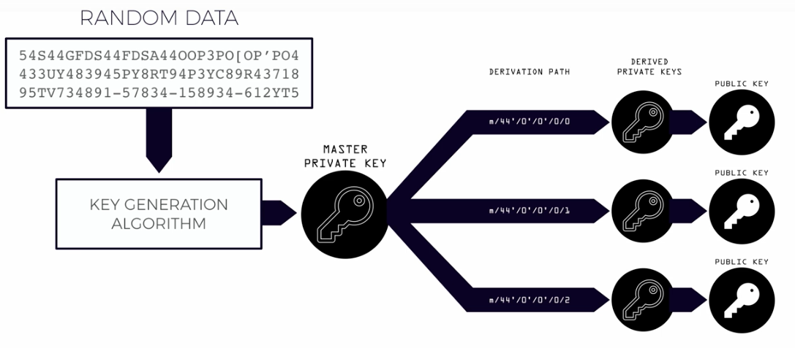
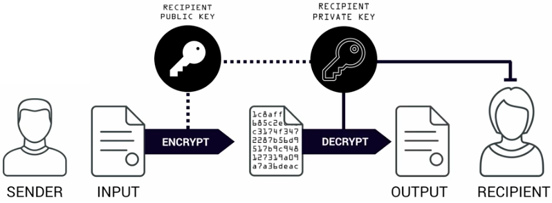
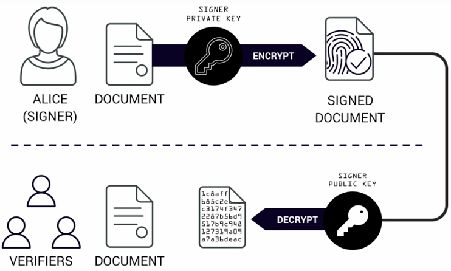

# Public Key Cryptography

Also known as _Asymmetric Cryptography_

- Uses a key pair: Public and Private keys
    - These keys have a unique and complex mathematical relationship
    - Most key generation algorithms allow for the _Public key_ to be derived from the _Private key
- _Private keys_ are generated by inputting data into a _key generation algorithm_
- _Public keys_ and _Ethereum addresses_ can be derived from the _Private key_
- Using an implementation of an _Elliptic Curve Signature_ algorithm, an _Ethereum address_ can be generated with _Public/Private key pairs_, along with the functionality of generated additional _Ethereum addresses_ and _Public/Private key pairs_, forming a parent-children relationship

- Public key cryptography provides 2 main features:

    1. Encryption - Only the _private key holder_ can **decrypt** a message **encrypted** with the _corresponding public key_
    - **Use case**: Sending a secret message to someone, and verifying that only they can read it
        - **How it works**: 
            1. Person A owns _public_ and _private key A_
            2. Person A shares _public key A _with Person B
            3. Person B can encrypt a message with _public key A_, and publish it absolutely publicly without fear that someone ,other than Person A, can decrypt the message
                - This works because only the _private key_ that is a counterpart of the _public key_ used to encrypt a message, can decrypt the message
            4. Person A takes the encrypted message, and decrypts it with _private key A_
            

    2. Authentication - A public key can verify ownership of a private key using _digital signatures_
    - **Use case**: Verifying that a sender's document has not be tampered with
        - **How it works**:
            1. Person A owns _public_ and _private key A_
            2. Person A signs a document with _private key A_, effectively encrypting the message
            3. Any Person with access to _public key A_ can take the encrypted document, and decrypt it to get the originally signed document
                - Because the document was signed/encrypted with _private key A_ **only** the corresponding _public key A_ can be used to decrypt the document
            4. To prove Person A's document has not be tampered with, a Person can take the decrypted document and compare it to the original document that Person A signed with _private key A_
            

## How are ethereum address generated

1. Create a random _private key_
2. Using an **Elliptic Curve Digital Signature Algorithm (ECDSA)**, derive the _public key_ from the _private key_
3. Take the _Keccak-256 hash_ of the _public key_ and drop the **first 24 characters** and add `0x` to the beginning to generate the _Ethereum address_

## Additional Resources

- [How are ethereum addresses generated?](https://ethereum.stackexchange.com/questions/3542/how-are-ethereum-addresses-generated)
- [Create full ethereum key pair and address](https://kobl.one/blog/create-full-ethereum-keypair-and-address/)