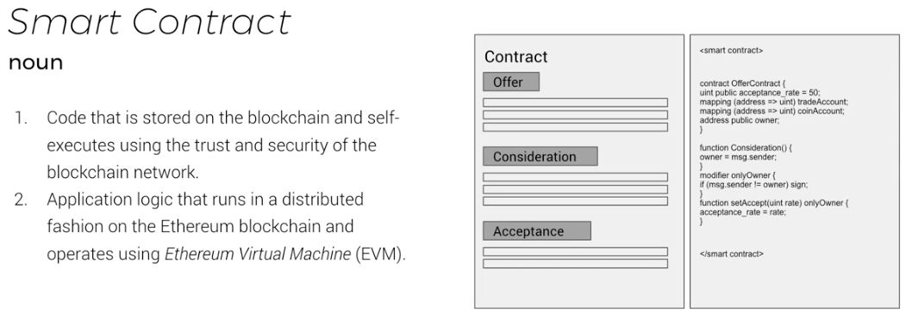

# Smart Contracts

"A computer protocol to digitally execute terms of a contract"

Features of _Smart Contracts_:

- Trustless
    - No 3rd parties or intermediaries are required in order for a _Smart Contracts_ to execute the terms
    - Universally accessible, anyone should be able to view the _Smart Contract_ completely on their own
- Trackable
    - Transactions should be traceable from beginning to end to allow for auditing
- Irreversible
    - Once a transactions is in it's final state, it should be unable to be altered or reverted
- Self-executing
    - _Smart Contracts_ should be able to carry out their terms without the aid of any party
        - This helps:
            - Reduce costs
            - Increase execution speed
            - Increase use case variability

_Smart Contracts_ do not have to exist solely on _blockchains_, but _blockchains_ offer:

- A trustless, universally accessible system
- Trackable, irreversible transactions
- Mechanisms for self-execution

## Additional Resources

- [Introduction to Smart Contracts](https://solidity.readthedocs.io/en/develop/introduction-to-smart-contracts.html#)
- [What is a smart contract?](https://blog.tokenfoundry.com/what-is-a-smart-contract/)
