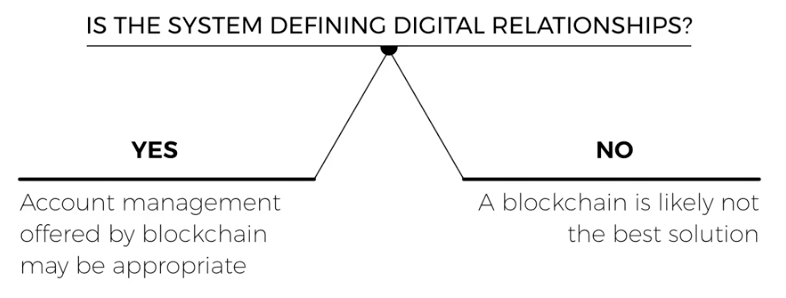

# Decentralized Application Development

## When to Use A Blockchain

## Additional Resources

- [Ethereum for Web Developers](https://medium.com/@mvmurthy/ethereum-for-web-developers-890be23d1d0c)
- [Building for Blockchain: Transitioning from Web 2.0 to Web 3.0 ](https://blog.ycombinator.com/building-for-the-blockchain/)
- [A Brief Overview of dApp Development](https://thecontrol.co/a-brief-overview-of-dapp-development-b8ac1648322c)
- [Building for Blockchain: Transitioning from Web 2.0 to Web 3.0 ](https://blog.ycombinator.com/building-for-the-blockchain/)
