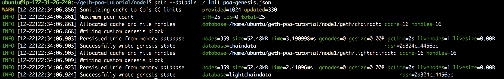
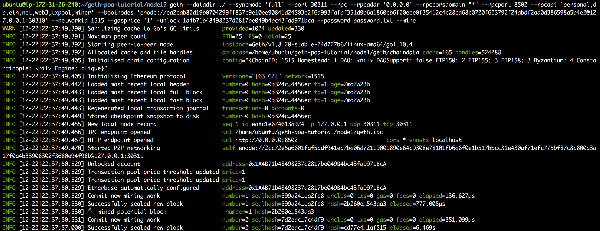
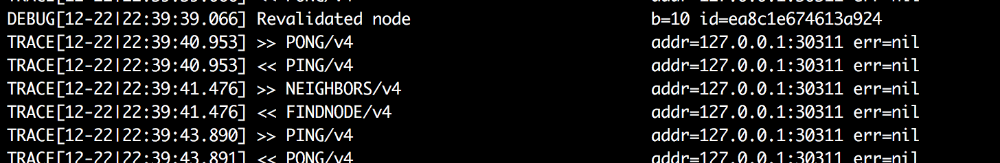
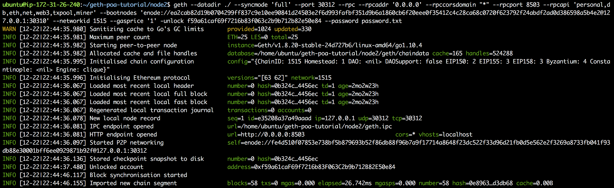
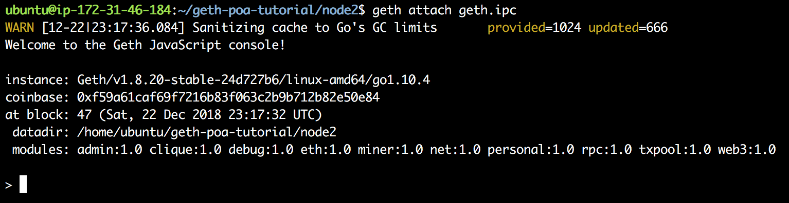
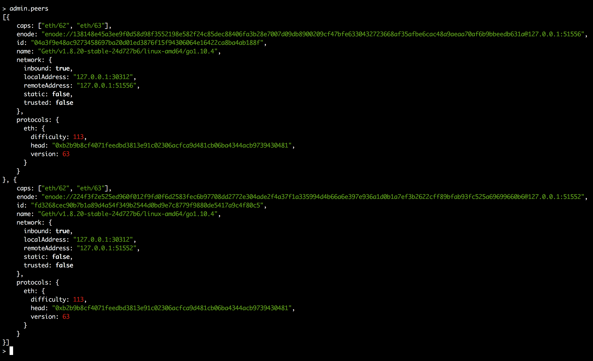

# Geth Proof-of-Authority Tutorial

[Hackernoon Tutorial](https://hackernoon.com/setup-your-own-private-proof-of-authority-ethereum-network-with-geth-9a0a3750cda8)

## What is Proof of Authority (PoA)?

[Proof-of-Authority](https://wiki.parity.io/Proof-of-Authority-Chains) is a consensus mechanism used as an alternative to Proof of Work. Where Proof of Work relies on miners expending computing power in a race to create the next block and secure the blockchain, Proof of Authority designates this role to a number of "authority" nodes. In a typical Proof of Authority network, one node or a series of nodes act as validators for the entire network.

Proof-of-Authority (PoA) is an easier way to run a blockchain with semi-trusted participants, such as a consortium blockchain. Designated signers create the possibility of a small, secure blockchain not worried about [51% attacks endemic to Proof-of-Work secured blockchains](https://en.bitcoin.it/wiki/Majority_attack). PoA also comes with transaction finality, so a new node syncing to the PoA network only has to obtain the latest block to know the state of the network.


## Table of Contents

- [Project Setup](#project-setup)
- [Configuring Clique via Puppeth](#configuring-clique-via-puppeth)
    - [Network Name](#network-name)
    - [Configure New Genesis Block](#configure-new-genesis-block)
    - [Clique Consensus Mechanism](#clique-consensus-mechanism)
    - [Block Time](#block-time)
    - [Sealer Nodes](#sealer-nodes)
    - [Pre-Funded Accounts](#pre-funded-accounts)
    - [Network ID](#network-id)
    - [Exporting Genesis Block](#exporting-genesis-block)
- [Starting the Network](#starting-the-network)
    - [Launching the Bootnode](#launching-the-bootnode)
    - [Launching Node 1](#launching-node-1)
    - [Launching Node 2](#launching-node-2)
    - [Launching Node 3](#launching-node-3)
    - [Transactions](#transactions)
    - [Opening geth REPL console](#opening-geth-repl-console)
    - [Locating account names](#locating-account-names)
    - [Constructing and Sending Transactions](#constructing-and-sending-transactions)
    - [Adding or Removing Signers From the Network](#adding-or-removing-signers-from-the-network)
- [Further-Reading](#further-reading)

## Project Setup

The project directory for this tutorial can be found [here](https://drive.google.com/a/consensys.net/file/d/1cJd-Glzfzj5Z9tBOK6HUHQDfnNtPWJ26/view?usp=sharing)

Geth is required, and can be downloaded [here](https://github.com/ethereum/go-ethereum/wiki/Building-Ethereum)

**Note**: This tutorial was created using geth `1.8.14`

Start by `cd`ing into the `geth-poa-tutorial` directory

## Clique Protocol

geth now comes with a native Proof-of-Authority protocol called Clique. It creates a genesis block detailing the important specifications of a Proof-of-Authority network. These include:

- Who are the valid signers of blocks in this network?
- Which accounts are pre-funded in this network?
- How often will a block be broadcast by valid signers?

Clique has an important security feature. **Any signer can only produce a certain number of consecutive blocks**. That number is contingent on the number of total number of signers encoded in the genesis block. The equation for that number is `CONSECUTIVE_BLOCK_LIMIT = (NUMBER_OF_TOTAL_SIGNERS / 2) + 1`

For example, if there are four nodes designated as signers in the genesis block, one of those signers can only broadcast `(4 / 2) + 1 = 3` blocks before the network will refuse any more blocks confirmed by that node. **Only until another one of the four designated signers confirms a block can the original node resume submitting**.

This creates a mild safeguard against a rogue node overtaking a network and maliciously altering the network state. It also, however, can freeze your network if not enough valid signers are online.

Fun Fact: The Rinkeby testnet runs using Clique-generated Proof-of-Authority.

For more information about Clique, read [this Github issue from Péter Szilágyi explaining its release](https://github.com/ethereum/EIPs/issues/225).

[Table of Contents](#table-of-contents)

## Configuring Clique via Puppeth

geth includes the handy module puppeth for **creating custom genesis blocks**. The provided tutorial has the process scripted, but here's a walk through of what the script is doing:

### Network Name

For local caching purposes, puppeth asks you for a network name. **If it detects this network has been used before, it will pull the network information it has previously stored**.

### Configure New Genesis Block

Next, in the menu presented, select option `2` to `Configure new genesis`

### Clique Consensus Mechanism

Then, select the option `2` to use the `Clique - proof-of-authority` consensus method

Ethereum Mainnet currently runs on [Proof-of-Work](https://cointelegraph.com/explained/proof-of-work-explained) consensus. That's an awesome consensus mechanism for large networks sprawling the globle in a trustless manner, but for our small, down-home network, we're going to choose `Clique`, a [Proof-of-Authority](https://en.wikipedia.org/wiki/Proof-of-authority) consensus mechanism.

### Block Time

In blockchain networks, the block time is considered the "**network heartbeat**" — how often a confirmed block containing the latest confirmed transactions is broadcast out to the network.

In Proof-of-Work on Ethereum and Bitcoin, this time is moderated by a complex algorithm which has a target network time (~10m for Bitcoin, ~14s for Ethereum). It adjusts variables according to the current capacity of miners on the network.

In Proof-of-Authority, we don't need that complicated algorithm but we do need a set time to run an orderly network. Since Ethereum's block time is 12-14 seconds, we'll put our network's block time at 7 seconds.

Proof-of-Authority networks can decrease their block time and therefore increase their transaction throughput (the number of transactions processed per second). This is a desirable goal for certain blockchain use cases.

### Sealer Nodes

As discussed above, Proof-of-Authority networks allow only certain nodes, called "sealers" to confirm blocks in the network. Furthermore, the Clique consensus protocol only allows each sealer to confirm a certain number of consecutive blocks. For the sake of demonstrating Proof-of-Authority networks, we'll just put one here for simplicity's sake.

Note: The 0x prefix hexadecimal-encoded values to help program parsers. Read more [here](https://stackoverflow.com/questions/2670639/why-are-hexadecimal-numbers-prefixed-with-0x)

### Pre-Funded Accounts

Cryptocurrency units can be created one of two ways. First, someone can mine new blocks for a network and be rewarded in that cryptocurrency. Second, the creator of a network can designate certain accounts to have a certain balance in the genesis block (also known as a "pre-mine").

### Network ID

Nodes on a network need to determine which nodes they can connect with. With a custom-generated genesis block, we provide a Network ID so nodes can easily identify each other.

The Network ID can be any number you'd like.

After we enter Network ID, puppeth takes all the information we have provided it and creates a custom genesis block for our Proof-of-Authority network.

### Exporting Genesis Block

Lastly, the genesis block puppeth has created needs to be exported. Either provide a filename (and be sure to add .json to the end) or simply hit enter to accept the default name.

### Starting the Network

#### Launching the Bootnode

While in the directory geth-poa-tutorial, run:

```bash
bash ./bootnode/bootnode-start-local.sh
```

This terminal window is now our window into the networking elements of our PoA blockchain. The geth client will attempt to find other nodes via this bootnode (as described [here](https://github.com/ethereum/go-ethereum/wiki/Connecting-to-the-network)). We have asked it to provide all the information it receives and gives so we can watch the nodes come online and discover each other.

**Note**: The bootnode acts more as a network router or hub. It is a central point the nodes can contact to pass through their information and receive other nodes' information. It does not contain our custom genesis block.

#### Launching Node 1

Now, we will launch our first node. We have designated this to be the only sealer node, so it will be able to start mining blocks immediately.

Leave the bootnode terminal window open and create a new terminal window. I recommend placing it under the open bootnode terminal

From `geth-poa-tutorial` in the new terminal window, please enter this command:

`cd node1`

Then, please enter this command:

`geth --datadir ./ init poa-genesis.json`

You should see the following:



We have told the geth client: _"We'd like you to initialize the Ethereum protocol using this custom genesis block we've created."_

You'll know if the above command was successful if you see: `Successfully wrote genesis state`

To now actually start the Ethereum protocol using custom PoA genesis block, run (this command is also provided locally in geth-start-local.txt located within the node1 directory):

```bash
geth --datadir ./ --syncmode 'full' --port 30311 --rpc --rpcaddr '0.0.0.0' --rpccorsdomain "*" --rpcport 8502 --rpcapi 'personal,db,eth,net,web3,txpool,miner' --bootnodes 'enode://ea2cab82d19b0704299ff837c9e10ee90841d24503e2f6d993fafbf351d9b6a1860cb6f20eee0f35412c4c28ca68c0720f623792f24abdf2ad0d386598a5b4e2@127.0.0.1:30310' --networkid 1515 --gasprice '1' -unlock 1a4b71b48498237d2817be049b4bc43fad971bca --password password.txt --mine
```

If all is successful, you should see two things happen:

1. The Ethereum node running on node1 should start to mine blocks for the network



2. The bootnode window will light up with traffic.



The second phenomenon is node1 communicating with the bootnode...

Node 1: `'>>>PING' ("Are you there, bootnode? It's me, Node 1, running a custom protocol")`

Bootnode: `'<<<PONG' ("Yes, I'm here, Node 1")
...And trying to locate other nodes within the network...`

Node 1: `'>>> NEIGHBORS' ("Do you know of any other nodes like me?")`

Bootnode: `(`<<< FINDNODE`) ("Here's what I know about other nodes.")`

#### Launching Node 2

We're going to do the same thing with `Node 2`, with a few changes.

Open a third terminal screen and go to the geth-poa-tutorial directory. Type in this familiar command:

`cd node2`

Initialize geth with our custom genesis block:

`geth --datadir ./ init poa-genesis.json`

Actually start the Ethereum protocol by entering the slightly-different-but-still-long command below (available locally in the node2 directory under geth-start-local.txt):

NOTE: THE COMMAND BELOW LOOKS SIMILAR TO NODE 1 BUT IT IS DIFFERENT! YOU MUST COPY AND PASTE THE COMMAND BELOW FOR NODE 2

`geth --datadir ./ --syncmode 'full' --port 30312 --rpc --rpcaddr '0.0.0.0' --rpccorsdomain "*" --rpcport 8503 --rpcapi 'personal,db,eth,net,web3,txpool,miner' --bootnodes 'enode://ea2cab82d19b0704299ff837c9e10ee90841d24503e2f6d993fafbf351d9b6a1860cb6f20eee0f35412c4c28ca68c0720f623792f24abdf2ad0d386598a5b4e2@127.0.0.1:30310' --networkid 1515 --gasprice '1' -unlock f59a61caf69f7216b83f063c2b9b712b82e50e84 --password password.txt`

Again, you should see the node activity begin. You should also see more activity on the bootnode screen, this time registering requests from Node 1 AND Node 2:



**NOTE**: You do not see any mining activity from Node 2 because Node 2 is not a valid signer node. You can run it as a miner, but any blocks it submits, even valid ones, will be rejected from the network.

#### Launching Node 3

Open a fourth terminal, and run:

`cd node3`

Initialize geth with our custom genesis block:

`geth --datadir ./ init poa-genesis.json`

Copy and paste this UNIQUE NODE 3 COMMAND to actually start the protocol:

`geth --datadir ./ --syncmode 'full' --port 30313 --rpc --rpcaddr '0.0.0.0' --rpccorsdomain "*" --rpcport 8504 --rpcapi 'personal,db,eth,net,web3,txpool,miner' --bootnodes 'enode://ea2cab82d19b0704299ff837c9e10ee90841d24503e2f6d993fafbf351d9b6a1860cb6f20eee0f35412c4c28ca68c0720f623792f24abdf2ad0d386598a5b4e2@127.0.0.1:30310' --networkid 1515 --gasprice '1' -unlock 6dcccc3ab843cf7973986870fbffe55fca71acbd --password password.txt`

If all goes well, geth will boot up and a new node pop up in the bootnode window.

### Transactions

#### Opening geth REPL console

An Ethereum client creates an endpoint to connect with whatever blockchain its running. geth provides a [Javascript-based, REPL command-line interface](https://github.com/ethereum/go-ethereum/wiki/JavaScript-Console) to connect and interact with that endpoint. We can connect to that console and interact on our newly-created PoA blockchain.

In the terminal window for Node 2, navigate back to `geth-poa-tutorial/node2` and type the following command:

`geth attach geth.ipc`

If successful, you will see the Javascript Runtime start with a REPL console line:



Test to make sure you're connected to the network by running a few commands:

`admin.peers`

Will deliver a list of known peers (should be two, and the IDs should correspond with the traffic you see on your bootnode console). Here's what you should see:



Here are some other commands to help you get your bearings:

`net.version`

Should return our custom network ID of **1515**

`eth.blockNumber`

Should return the **latest block** mined by Node 1

`eth.coinbase`

Should return the **Ethereum address** for the node you are currently operating

#### Locating account names

Open the document labeled `poa-accounts.txt` to see the **Ethereum addresses** for Node 1, Node 2 and Node 3.

All these windows can get confusing! If you're unsure about which node's console you're in, simple enter `eth.coinbase` into the geth console tab to see the **Ethereum address**.

#### Constructing and Sending Transactions

Navigate to the geth console tab on one of your node terminal windows.

The command below is a generic one to send ether (the cryptocurrency unit for Ethereum networks) from one account to another account. Substitute 'RECEIPIENT_NODE_ADDRESS' with the forty-character address (surrounded by quotes '' but without the 0x prefix) of where you'd like to send it (For example, if you're Node 1, that will be Node 2 or Node 3).

Notice that `eth.getBalance(eth.coinbase)` returns a very large number (9.046256971e+74). This is the amount of Ether that we initialized the account with in the genesis block. Let's send a large amount of Ether to another address to observe the change.

```javascript
eth.sendTransaction({'from':eth.coinbase, 'to':'0xf59a61caf69f7216b83f063c2b9b712b82e50e84', 'value': 5e74})
```

If it's successful, the console will print a long string, which is your Receipt Transaction Hash. It's like your transaction ID that you can use to look up your transaction, and its status, later.

To see the changes caused by the transaction, wait at least as long as the block time (7 seconds in this case) to ensure that the transaction is included in the blockchain and enter this command into all three nodes' geth console:

```javascript
web3.fromWei(eth.getBalance(eth.coinbase), "ether")
```

The balances should be different by a factor of 13.5 for the two nodes involved in the transaction and the same as the pre-fund for the node not included.

### Adding or Removing Signers From the Network

[From Stack Overflow](https://ethereum.stackexchange.com/questions/15541/how-to-add-new-sealer-in-geth-1-6-proof-of-authority):

The protocol defines a voting mechanism to dynamically add new signers and remove existing ones. In Geth this can be controlled via the `clique.propose(address, authorized)` method (clique_propose for remote RPC calls).

To authorize a new signer, existing ones can propose it via `clique.propose("0x...", true)`. When more than half the signers proposed it, the authorization comes into effect immediately and the new account can start signing blocks.

Similarly, existing signers can propose deauthorizing existing ones via `clique.propose("0x...", false)`. Again if half + 1 signers deauthorize a signer, it is immediately removed from the list and blocks minted by it are rejected from that point onward.

### Further Reading

This tutorial aimed to explain the basics of **Proof-of-Authority**, show you how to start your own PoA private network and conduct transactions on that network. We hope you enjoyed it!

For more resources, please see the links below:

This tutorial is based on this post — [Setup Your Own Private Proof of Authority Ethereum Network with Geth](https://hackernoon.com/setup-your-own-private-proof-of-authority-ethereum-network-with-geth-9a0a3750cda8)

- [Proof of Authority Chains](https://wiki.parity.io/Proof-of-Authority-Chains) Parity Technologies

- [Proof-of-Authority Tutorial](https://wiki.parity.io/Demo-PoA-tutorial.html) Parity Technologies

- [Using Puppeth to Manually Create an Ethereum Proof-of-Authority Clique Network using AWS](https://medium.com/@collin.cusce/using-puppeth-to-manually-create-an-ethereum-proof-of-authority-clique-network-on-aws-ae0d7c906cce) Collin Cusce

- [Clique PoA Protocol Details](https://github.com/ethereum/EIPs/issues/225), Péter Szilágyi & Ethereum Foundation

- [Cliquebait Repo](https://github.com/f-o-a-m/cliquebait), from [FOAM](https://foam.space/)
