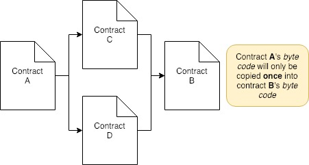

# Inheritance

- A contract inherits code from another contract using the `is` keyword
    - E.g. `contract mortal is owned`
- If contract **B** inherits contract **A**, than only contract **B** will be deployed to the blockchain
    - Contract **A**'s _byte code_ will be copied over into contract **B**'s _byte code_ when contract **B** is deployed
    - Contract **B**'s _byte code_ does **not** reference contract **A**'s _byte code_
- The _derived_ contract inherits from the _base_ contract:
    - State and state variables
    - Function and function modifiers
    - Events
- A contract can inherit multiple base contracts
    - E.g. `contract named is owned, mortal`
- If contracts **C** and **D** both inherit contract **A**, and contract **B** inherits both contract **C** and **D**, contract **A** will only be inherited **once** into contract **B**
    
- Functions in _derived contracts_ can **override** functions in _base contracts_
    - To override a _base function_, the _derived function_ must have:
        - The same **name**
        - The same **inputs**
            - Inputs **must** be of the **same type**
        - The same **outputs**
    - This is true for both _internal_ and _external_ functions
    - When a user calls a _derived function_ **the most derived function** gets called
    - The _base function_ can still bed called by explicitly using the _base contract's name_
- If a _base contract's_ constructor requires arguments, include them in the header:
    ```solidity
    pragma solidity ^0.4.0;

    contract Base {
        uint x;
        function Base(uint _x) public { x = _x; }
    }

    contract Derived is Base(7) {
        function Derived(uint _y) Base(_y * _y) public {

        }
    }
    ```
    In the above code, `Derived` is setting `uint x` to `7` when `Base` is inherited
- When inheriting multiple contracts:
    - Order matters
        - Specify order from the _most base like_ contract to _the most derived_
        ```solidity
        pragma solidity ^0.4.0;

        // This will not compile
        contract X {}
        contract A is X {}
        contact C is A, X {}

        // This will compile
        contact D is X, A {}
        ```
    - Function, modifiers, and event names **must** be **unique** amongst **the contract** and **all the base contracts**
- Abstract contracts are _derived_ contracts that don't have all _base functions_ implemented
    - The contracts **will not compile**
    - The can be used as _base contracts_ for other contracts that will eventually inherit / implement all _base functions_
- Interface contracts define function declarations, but **do not implement** any of the functions declared:
    ```solidity
    pragma solidity ^0.4.11;

    interface Token {
        function transfer(address recipient, uint amount) public;
    }
    ```
    - They are:
        - Defined with the `interface` keyword
        - Are inherited by other contracts
    - They don't:
        - Inherit from other contracts
        - Have:
            - A constructor
            - Variables
            - Structs
            - Enums
    - They are basically limited to what the contract ABI can represent
        - So the conversion between the ABI and the Interface should be possible **without** any information loss

## Additional Resources

- [Inheritance in Solidity](https://ethereumdev.io/inheritance-in-solidity/)
- [Inheritance, from the Solidity Docs](https://solidity.readthedocs.io/en/develop/contracts.html#inheritance)
- [Abstract contracts](https://solidity.readthedocs.io/en/latest/contracts.html#abstract-contracts)
- [Interfaces](https://solidity.readthedocs.io/en/latest/contracts.html#interfaces)
