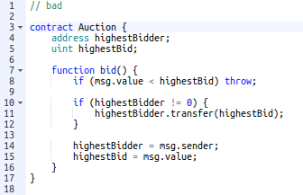

# Exploits and Dangers

## Reentrancy attacks

Reentrancy attacks can be problematic because calling external contracts passes control flow to them. The called contract may end up calling the smart contract function again in a recursive manner. 

```solidity
// INSECURE
mapping (address => uint) private userBalances;

function withdrawBalance() public {
    uint amountToWithdraw = userBalances[msg.sender];
    require(msg.sender.call.value(amountToWithdraw)()); // At this point, the caller's code is executed, and can call withdrawBalance again
    userBalances[msg.sender] = 0;
}
```

If you can’t remove the external call, the next simplest way to prevent this attack is to do the internal work before making the external function call.

```solidity
mapping (address => uint) private userBalances;

function withdrawBalance() public {
    uint amountToWithdraw = userBalances[msg.sender];
    userBalances[msg.sender] = 0;
    require(msg.sender.call.value(amountToWithdraw)()); // The user's balance is already 0, so future invocations won't withdraw anything
}
```

Or to use the withdrawal design pattern and separate the contract accounting logic and the transfer logic.

Another thing to be aware of is potential cross function re-entrancy. This can be problematic if your contract has multiple functions that modify the same state. 

```solidity
// INSECURE
mapping (address => uint) private userBalances;

function transfer(address to, uint amount) {
    if (userBalances[msg.sender] >= amount) {
       userBalances[to] += amount;
       userBalances[msg.sender] -= amount;
    }
}
```

Another thing to be aware of is potential cross function re-entrancy. This can be problematic if your contract has multiple functions that modify the same state. 

```solidity
// INSECURE
mapping (address => uint) private userBalances;

function transfer(address to, uint amount) {
    if (userBalances[msg.sender] >= amount) {
       userBalances[to] += amount;
       userBalances[msg.sender] -= amount;
    }
}

function withdrawBalance() public {
    uint amountToWithdraw = userBalances[msg.sender];
    require(msg.sender.call.value(amountToWithdraw)()); // At this point, the caller's code is executed, and can call transfer()
    userBalances[msg.sender] = 0;
}
```

In this case, the attacker can call transfer() when their code is executed on the external call in withdrawBalance. Since their balance has not yet been set to 0, they are able to transfer the tokens even though they already received the withdrawal. This vulnerability was also used in the DAO attack.

There are several ways to mitigate these problems.

It is generally a good idea to handle your internal contract state changes before calling external contracts, such as in the withdrawal design pattern. Use battle tested design patterns and learn from other people’s mistakes and heed their advice.

A more complex solution could implement mutual exclusion, or a mutex. This allows you to lock a state and only allow changes by the owner of the lock.

You can dig deeper into known attacks such as these [here](https://consensys.github.io/smart-contract-best-practices/known_attacks/#race-conditions42).

## Transaction Ordering and Timestamp Dependence

The previous examples of race conditions involved an attacker executing malicious code in a single transaction. Here we focus on how transactions are included in the blockchain and considerations around the process.

Transactions that are broadcast to the network but have not yet been included in a block are in the mempool.

Miners choose the order in which to include transactions from the mempool into a block that they are mining.

 Also, since transactions are in the mempool before they make it into a block, anyone can know what transactions are about to occur on the network.


This can be problematic for things like decentralized markets.

Protecting against this is difficult and you will likely need to devise contract specific solutions.

Decentralized markets can mitigate concerns by implementing batch auctions or using a pre-commit scheme, where the details are submitted after the transaction is committed.

## Integer Overflow and Underflow

Integers can underflow or overflow in the EVM.

The max value for an unsigned integer is 2 ^ 256 - 1, which is roughly 1.15 times 10 ^ 77. If an integer overflows, the value will go back to 0. For example, a variable called score of type uint8 storing a value of 255 that is incremented by 1 will now be storing the value 0.

You may or may not have to worry about integer overflow depending on your smart contract.

A variable that can be set by user input may need to check against overflow, whereas it is infeasible that a variable that is incremented will ever approach this max value.

Underflow is a similar situation, but when a uint goes below its minimum value it will be set to its maximum value.

 Be careful with smaller data types like uint8, uint16, etc… they can more easily reach their maximum value

## Denial of Service

 

Another danger of passing execution to another contract is a denial of service attack.

In the provided example, the highestBidder could be another contract and transferring funds to the contract triggers the contract’s fallback function. If the contract’s fallback always reverts, the Auction contract’s bid function becomes unusable - it will always revert. The bid function requires the transfer operation to succeed to fully execute.

The contract at the provided address throws an exception, execution halts and the exception is passed into the calling contract and prevents further execution.

This problem is avoidable using the withdrawal pattern.

## Force Sending Ether

Another danger is using logic that depends on the contract balance. 

Be aware that it is possible to send ether to a contract without triggering its fallback function.

Using the selfdestruct function on another contract and using the target contract as the recipient will force the destroyed contract’s funds to be sent to the target.

It is also possible to precompute a contracts address and send ether to the address before the contract is deployed.

The contract’s balance will be greater than 0 when it is finally deployed.

## Additional Resources

- [A survey of attacks on Ethereum smart contracts](https://eprint.iacr.org/2016/1007.pdf)
- [A list of known bugs from the Solidity docs](https://solidity.readthedocs.io/en/develop/bugs.html)
- [A hacker stole $31M of Ether  -  how it happened, and what it means for Ethereum](https://medium.freecodecamp.org/a-hacker-stole-31m-of-ether-how-it-happened-and-what-it-means-for-ethereum-9e5dc29e33ce)
