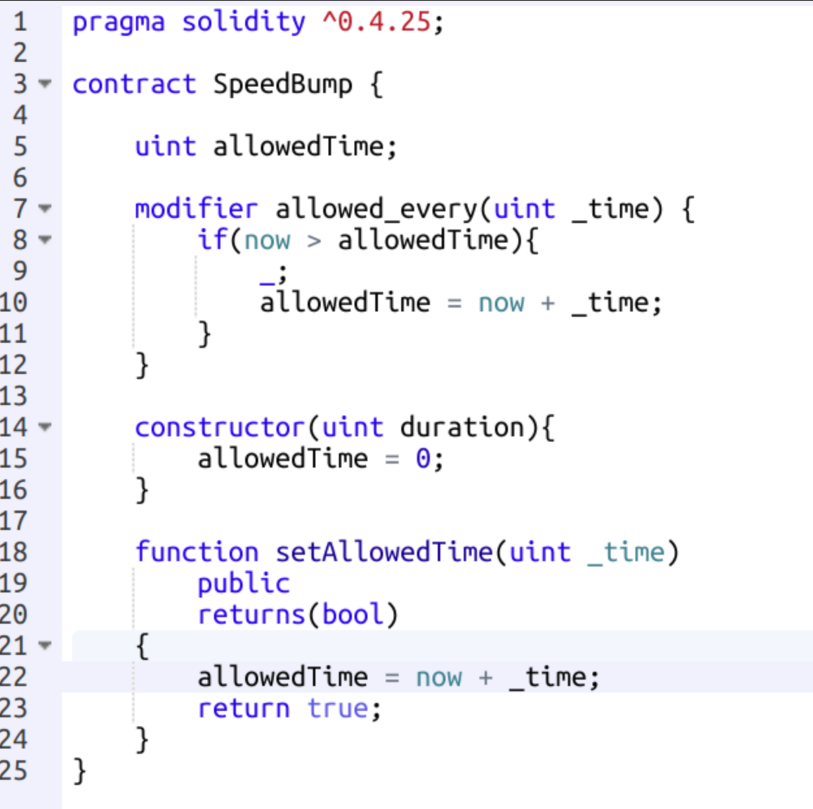

# Design Patterns

## Fail early and fail loud

```solidity
//Bad code, do not emulate

function silentFailIfZero(uint num) public view returns (uint){
    if(num != 0){
        return num;
    }
}
```

This function will fail without throwing an exception. This is a bad practice because it is not immediately clear whether the function executed properly or not.

```solidity
function throwsErrorIfZero(uint num) public view returns (uint){
    require(num != 0);
    return num;
}
```
This function checks the condition required for execution as early as possible in the function body and throws an exception if the condition is not met. This is a good practice to reduce unnecessary code execution in the event that an exception will be thrown.

## Restricting Access

You cannot prevent people or computer programs from reading your contracts’ state. The state is publicly available information for anyone with access to the blockchain.

However, you can restrict other contracts’ access to the state by making state variables private.

```solidity
contract C1 {

 uint private internalNum;

}
```

You can restrict function access so that only specific addresses are permitted to execute functions.

This is useful for allowing only designated users, or other contracts to access administrative methods, such as changing ownership of a contract, implementing an upgrade or stopping the contract.


It can be useful to restrict function access to owners, a more general admin class or to any stakeholder in the system.

## Auto Deprecation

The auto deprecation design pattern is a useful strategy for closing contracts that should expire after a certain amount of time.

This can be useful when running alpha or beta testing for your smart contracts.

Remember that using timestamps such as the now keyword are subject to manipulation by the block miners in a 30-second window.


## Mortal

Implementing the mortal design pattern means including the ability to destroy the contract and remove it from the blockchain.


You can destroy a contract using the selfdestruct keyword. The function to do it is often called kill.

It takes one parameter which is the address that will receive all of the funds that the contract currently holds.

As an irreversible action, restricting access to this function is important.

## Pull over Push Payments

[Navigate to this fund splitter contract on Github](https://gist.github.com/critesjosh/80d41928db2310684bc7660aa45873da).

There are a few key takeaways from this contract.

First, There is a separation of function logic. The split() function handles the accounting and divides the msg.value sent with the transaction. Another function, withdraw(), allows accounts to transfer their balance from the contract to their account.

This pattern is also called the withdrawal pattern. It protects against re-entrancy and denial of service attacks that we will cover in the next lesson.

## Circuit Breaker

Circuit Breakers are design patterns that allow contract functionality to be stopped. This would be desirable in situations where there is a live contract where a bug has been detected. Freezing the contract would be beneficial for reducing harm before a fix can be implemented.

Circuit breaker contracts can be set up to permit certain functions in certain situations. For example, if you are implementing a withdrawal pattern, you might want to stop people from depositing funds into the contract if a bug has been detected, while still allowing accounts with balances to withdraw their funds.

```solidity
contract CircuitBreaker {

    bool public stopped = false;

    modifier stopInEmergency { require(!stopped); _; }
    modifier onlyInEmergency { require(stopped); _; }

    function deposit() stopInEmergency public { … }
    function withdraw() onlyInEmergency public { … } 
}
```

In a situation such as this, you would also want to restrict access to the accounts that can modify the stopped state variable, maybe to the contract owner (such as multisig wallet) or a set of admins.

## State Machine

Contracts often act as a state machine, where the contract has certain states in which it behaves differently and different functions can and should be called. A function call often ends a stage and moves the contract to the next stage (especially if the contract models interaction). It is also common that some stages are automatically reached at a certain point in time.

The Colony token weighted voting protocol implemented this design pattern to manage the poll state.


Admins can only add poll options in the poll creation stage. Votes can only be submitted when the poll was active. The poll can only be resolved after the poll close time has been reached.

## Speed Bump

Speed bumps slow down actions so that if malicious actions occur, there is time to recover.



For example, ["The DAO" contract](https://github.com/slockit/DAO/) required 27 days between a successful request to split the DAO and the ability to do so. This ensured the funds were kept within the contract, increasing the likelihood of recovery.

## Additional Resources

- [Common Design Patterns](https://solidity.readthedocs.io/en/develop/common-patterns.html)
- [Design Patterns](https://github.com/cjgdev/smart-contract-patterns)
- [Pull over push payments example](https://gist.github.com/critesjosh/80d41928db2310684bc7660aa45873da)
